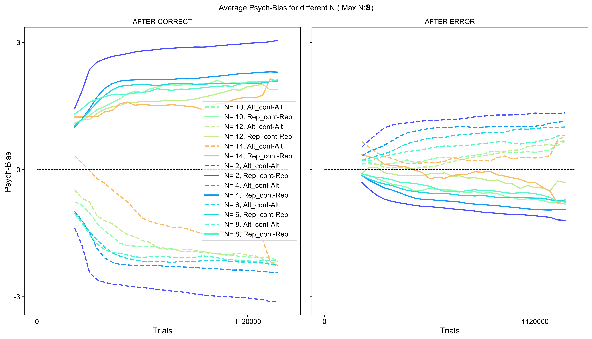

# FinalDegreeProject
This repository contains the scripts used for the realisation of my final degree project, which until 15th June was develeoped originally in [this repository](https://github.com/manuelmolano/multiple_choice), where I worked cooperatively with [Manuel Molano](https://github.com/manuelmolano). 

Abstract
==================
During perceptual decision making tasks, it has been shown that humans, non-human primates and rodents build prior expectations that influence their decisions if the statistics of the sensory information change with time. This is known as history bias and can take many forms. In this line we find the work performed by Hermoso-Mendizabal et al. (2020), where they characterize different types of history bias observed in rats performing a 2-Alternative Forced Choice (2AFC) task. A very surprising finding was that rats reset one type of history bias after an incorrect response, the so-called transition bias: a tendency to repeat or alternate their previous response by means of an internal trial-by-trial estimate of the serial correlation between trials. These findings were relevant because they do not represent an optimal strategy. In an attempt to elucidate this, in this study we proposed the hypothesis that  perhaps rats' brain is configured for a more complex environment than just a 2AFC task, and have thus developed a "reset strategy" more optimal for contexts with more than just two possible choices, as is the real world. To test this computationally we trained Artificial Neural Networks on a N-AFC task where the number of available choices also varied with time and successfully found that networks developed the same reset observed in rats.

The code
==================
There is a total of 6 main files in this project:

  -nalt_perceptualdecisionmaking.py: environment representing a N-Alternative Forced Choice task 
  -n_alt_variable.py: wrapper developed within [NeuroGym](https://github.com/gyyang/neurogym) toolkit and contributed to such.             Introduces varying blocks of maximum effective choices during certain number of trials
  -trial_hist.py: wrapper developed within [NeuroGym](https://github.com/gyyang/neurogym) toolkit and contributed to such.                 Introduces blocks where probabilities for each possible choice being the ground truth might be different. 
  -Plots.py: contains Python file that plots diferrent combinations of previous wrappers and anvironment  put together. 
  -helper_functions.py	: analytical functions mainly, used to compute performance, transition probability matrices and different types   of bias.
  -plotting_functions.py: functions used to plot results obtained and data
  training.py	Add files via upload: short scrit used for initial test training of algorithms

The results
==================
Overall these findings seem to suggest that RNNs develop a transition bias through train-ing that influences their choices based on the current status of the environment. Networks realise in which transition block they are, either for the trial-history or nch-block.  More interestingly, an increasing reset in bias after an error as N increased has been observed in all approaches to measure the bias.  After networks make a mistake, the expectation about next choice seems to vanish.  A reset-and-rebound dynamics have also been observed.  And finally, the Generalized Linear Model analysis enabled us to disentangle the effect of each type of current and past transitions on next choice.  Both shape and range of values obtained for the different transition regressors are very similar to those observed experimentally in Hermoso-Mendizabal et al. (2020).  All in all, results seem to provide robust evidence in favour of proposed hypothesis. When the complexity of the environment is increased, reset is the preferred strategy after an error by networks.

Psychometric curve-derived bias:
(

GLM results compared:
(compared_GLM_averages_max_N_8_num_tr_back_1.png)

Rebound curve for N=8:
(case14.png)

Transition  kernels or T weights:
(compared_GLM_kernel_averages_max_N_8_num_tr_back_1.png)
